# Double Slit Experiment

The double-slit experiment is one of the most important experiments to introduce the fundamentals of quantum
and to begin to give the explanations of quantum physics.

This experiment was first introduced by Thomas Young in 1801 to understand the wavelike behavior of light but giving
new theories about quantum mechanics, interference and the possibilities of a particle being in two spaces at the same time.

## Materials

- Aluminium foil.
- Laser.
- Tape
- Scalpel.
- Scissors.
- Cutter.

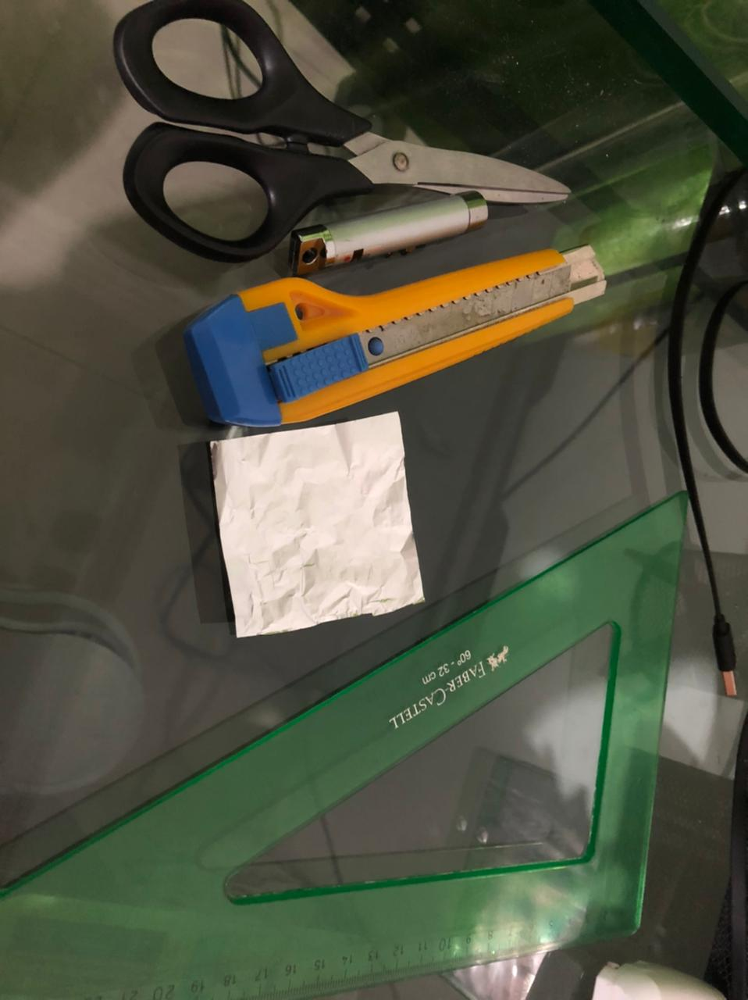

## Development

- With a piece of aluminum foil, we will cut two small lines as close together as possible.

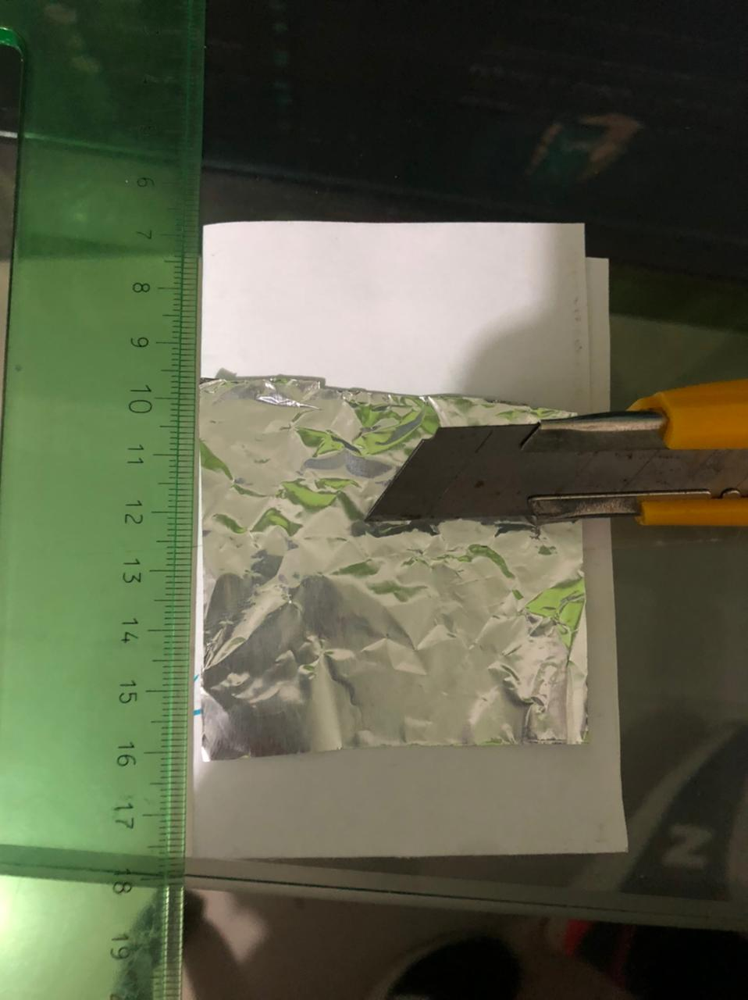

- Place the piece of aluminum foil on the edge of a box.

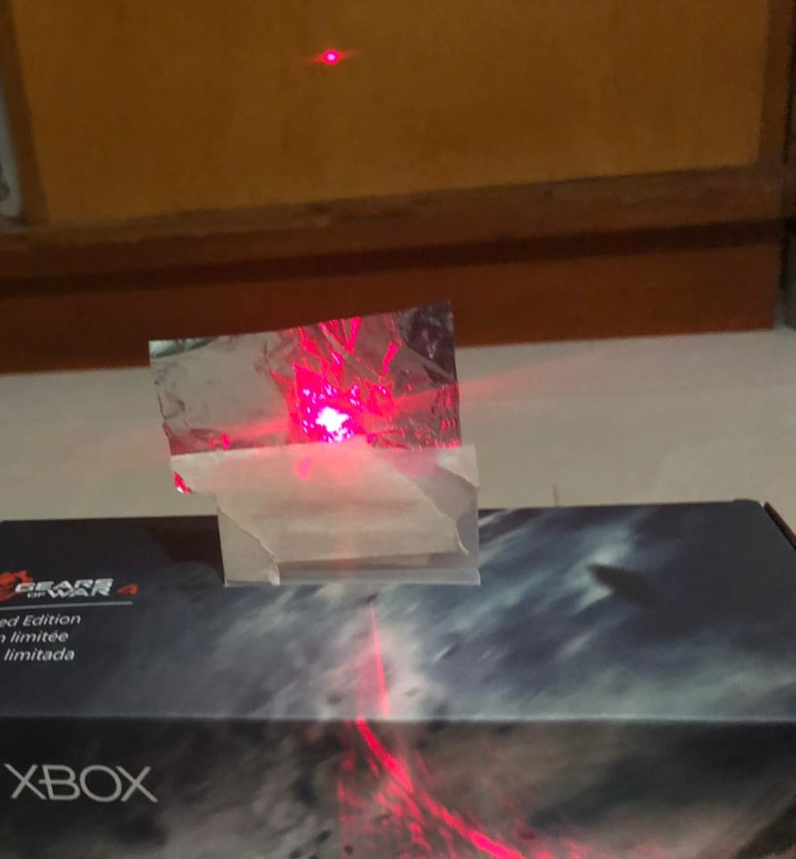

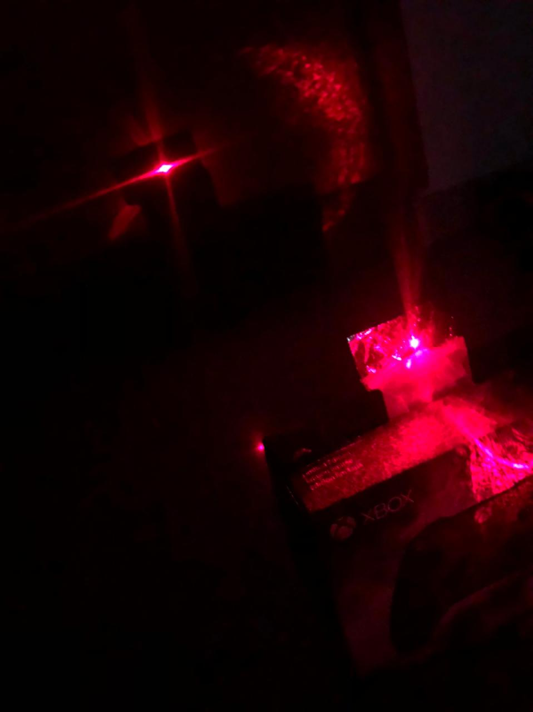

- Place the laser on a surface and tape it to light up..

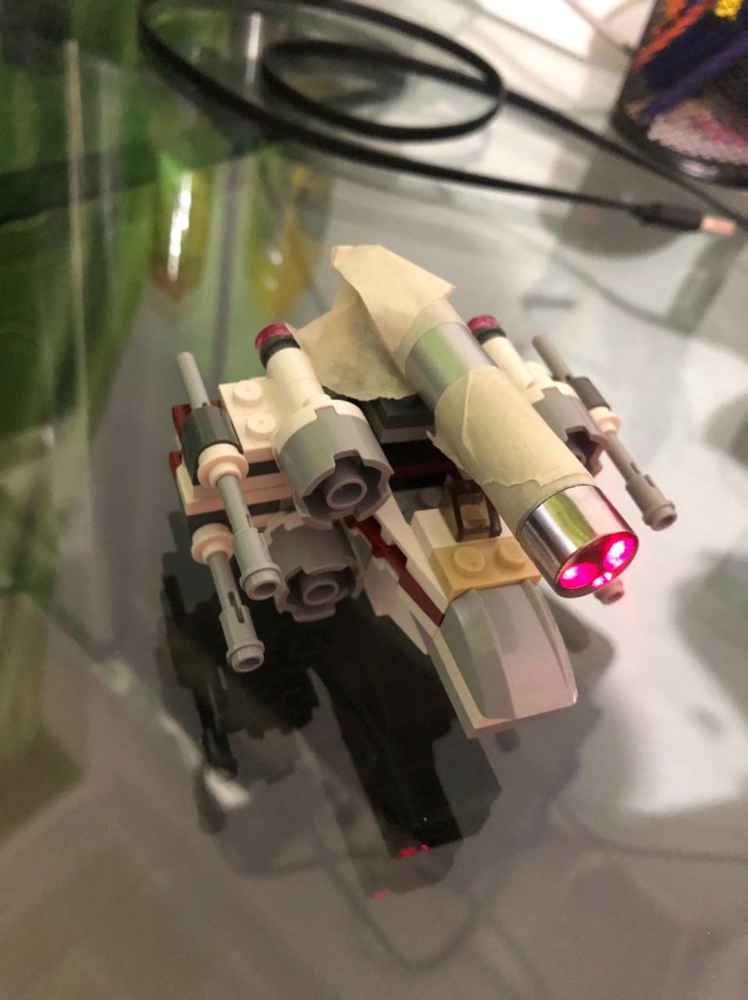

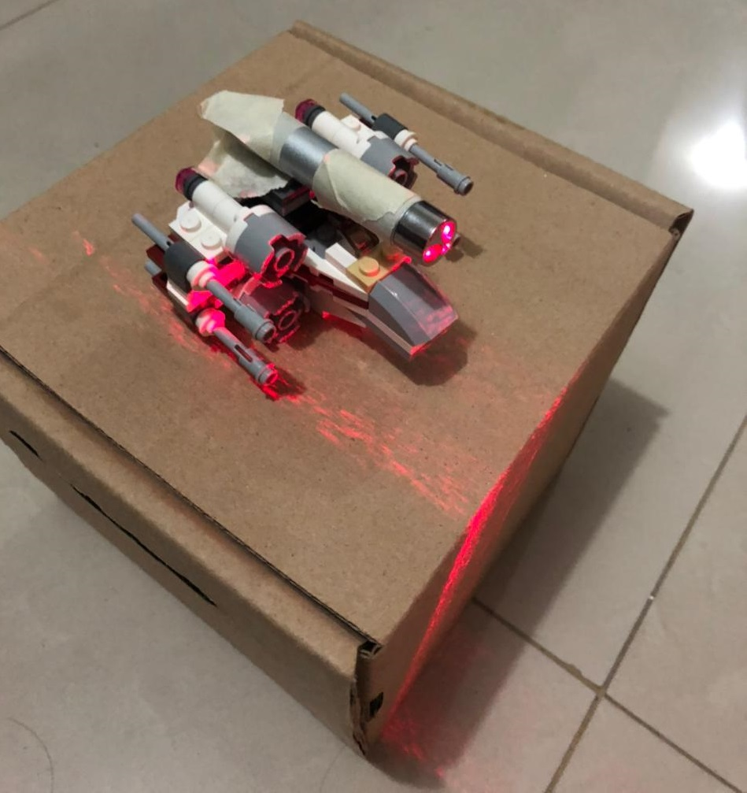

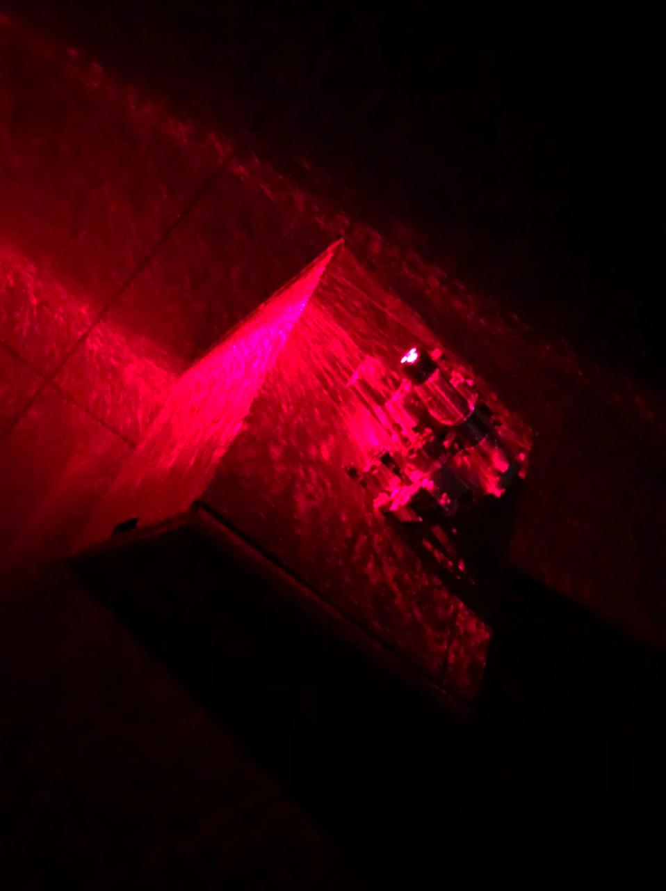

- Align the laser and the piece of aluminum foil in front of a wall and on the wall we found the phenomena.

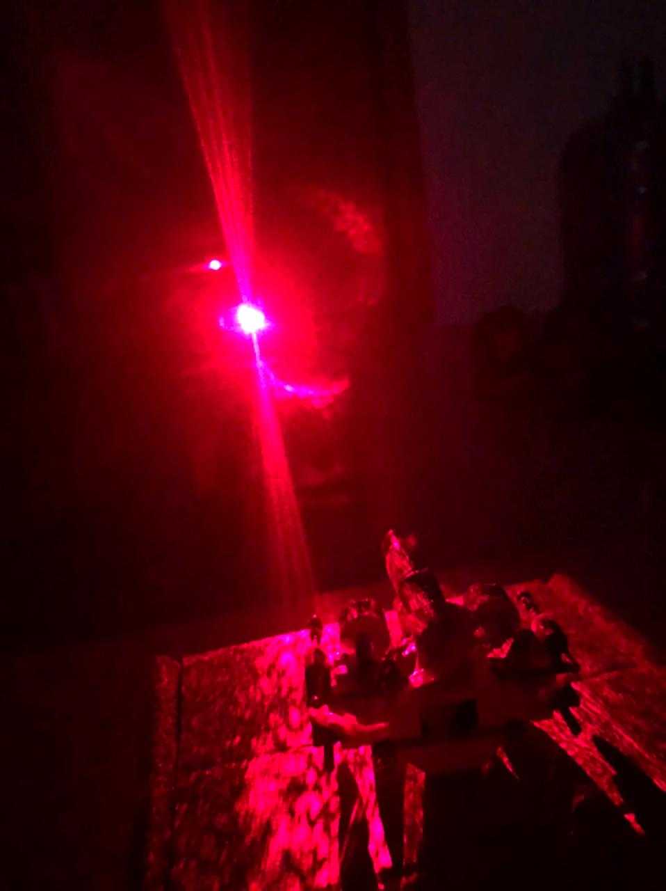


## Results

For the experiment to be done in a correct way, we placed the boxes away from the wall so that we could see the interference pattern well.
We saw that the pattern was similar to the reference pattern, so we can explain what happens when we align the piece of aluminum foil and the laser.

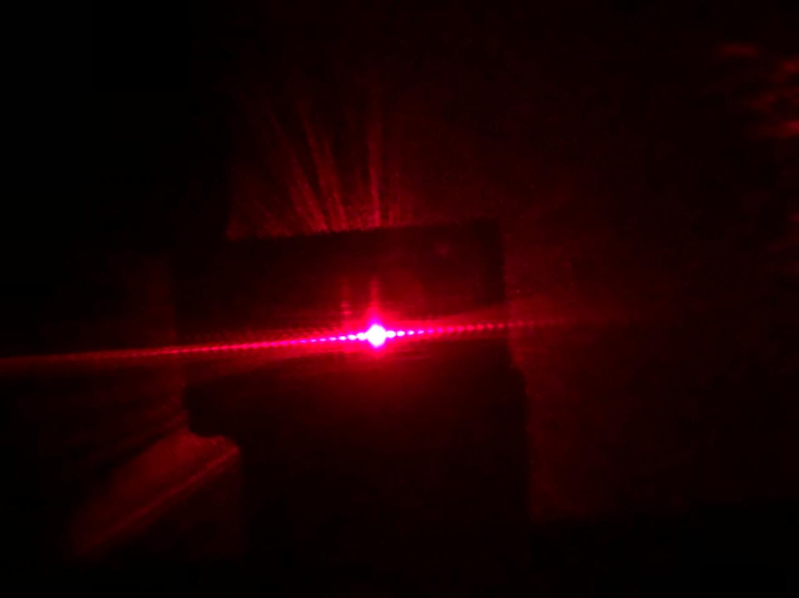


## Explanation

For the experiment we shoot a beam of light passing through a piece of aluminum foil, taking into account that our experiment is a double slit experiment, we can use the Schrödinger wave equation which explains very clearly this experiment giving the pattern of the theory if there are two slits without interference making us think that the particle is in two places at the same time introducing the idea of a multiverse where the particle moves to make us think that it is in two places and ends up in the initial universe at the same time. 
which makes us think that the particle is in two places at the same time introducing the idea of a multiverse where the particle moves to make us think that it is in two places and in the end ends up in the initial universe also allows us to predict if we would have an interference if we had a particle in two places at the same time.
For this experiment the wall impact probabilities form the following pattern:


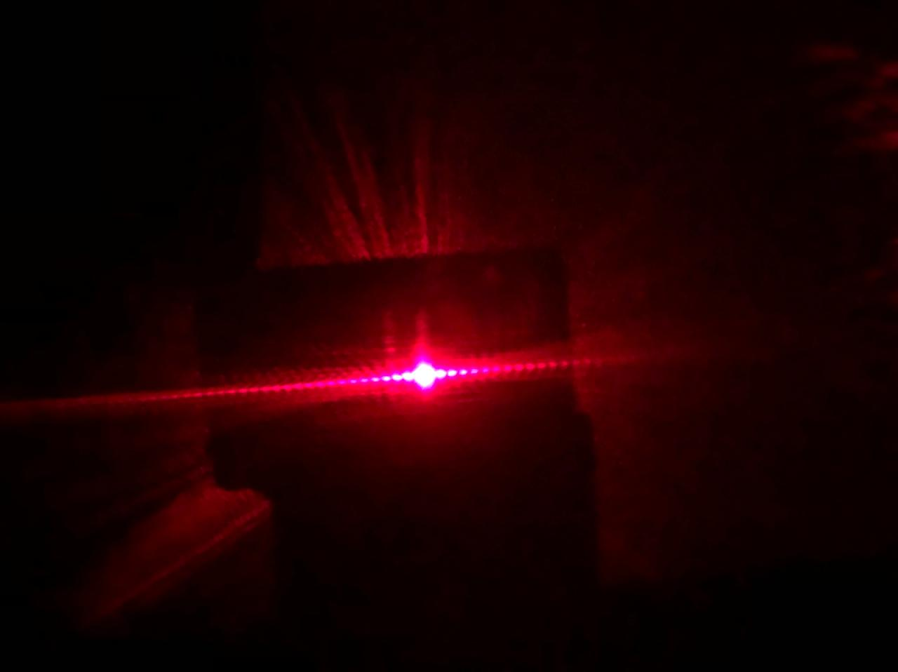

We found that in the center the probabilities are the highest but in the other concentrations it is also possible to have an impact there. 
Trying to understand this as a matrix we have the following state matrix:

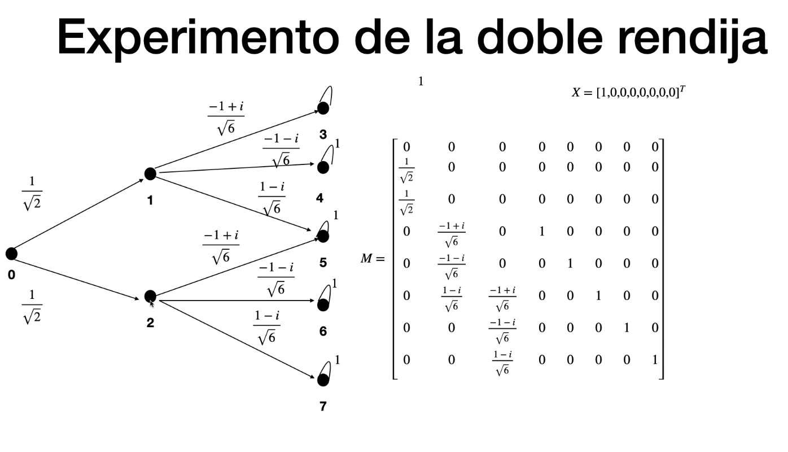

Where we can state that the highest probabilities are in the center of the pattern and that the other probabilities are equal.

## Simulation

To simulate the experiment we use the library of this [repository](https://github.com/CamiloBzt/ClassicalToQuantum/tree/master) with the matrix given in the explanation and an initial state vector:

```
matrix = np.array(
            [[0, 0, 0, 0, 0, 0, 0, 0],
            [1 / np.sqrt(2), 0, 0, 0, 0, 0, 0, 0],
            [1 / np.sqrt(2), 0, 0, 0, 0, 0, 0, 0],
            [0, -1 + 1j / np.sqrt(6), 0, 1, 0, 0, 0, 0],
            [0, -1 + 1j / np.sqrt(6), 0, 0, 1, 0, 0, 0],
            [0, -1 + 1j / np.sqrt(6), -1 + 1j / np.sqrt(6), 0, 0, 1, 0, 0],
            [0, 0, -1 + 1j / np.sqrt(6), 0, 0, 0, 1, 0],
            [0, 0, -1 + 1j / np.sqrt(6), 0, 0, 0, 0, 1]])      
```

```
state = np.array([[1],
                  [0],
                  [0],
                  [0],
                  [0],
                  [0],
                  [0],
                  [0]])
```

We have used this in a probabilistic quantum system with at least two clicks and obtained the following results:

```
ans = multipleSlitsQuantum(matrix, vect, 2)  # 2 clicks

print(ans)

[[0.        +0.j]
 [0.        +0.j]
 [0.        +0.j]
 [0.58333333+0.j]
 [0.58333333+0.j]
 [2.33333333+0.j]
 [0.58333333+0.j]
 [0.58333333+0.j]]
```

With these results we can affirm that our simulation is connected with the experiment because the highest probabilities are in the center (ans[5]), validating the experiment.

```
print(ans[5])

[2.33333333+0.j]

```

## Authors

* **Juan Camilo Bazurto Arias** - *Systems Engineering Student* - [Linkedin](https://www.linkedin.com/in/juan-camilo-b-b65379105/) - [GitHub](https://github.com/CamiloBzt)